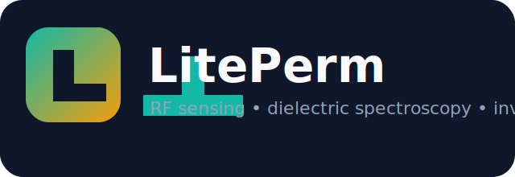

# LitePerm

<p align="center">
  
</p>

<p align="center">
  <strong>Open-source RF sensing, dielectric spectroscopy, inverse electromagnetic modelling, and simulation-assisted material characterisation</strong>
</p>

<p align="center">
  LiteVNA • S11 Analysis • Permittivity Extraction • Inverse Modelling • Full-Wave Simulation • Research Data Management
</p>

---

## Overview

LitePerm is an open-source Python platform for turning one-port RF measurements into usable sensing and material-characterisation workflows.

It started as a LiteVNA dielectric spectroscopy dashboard and has grown into a modular research framework for:

- importing LiteVNA measurements
- visualising S11, impedance, admittance, and Smith charts
- estimating complex permittivity and conductivity
- running inverse electromagnetic material estimation
- storing experiments and metadata for research traceability
- preparing for solver-backed and AI-assisted RF sensing workflows

LitePerm is designed for academic labs, engineering teams, postgraduate research, and collaborators who need a transparent alternative to closed VNA analysis software.

## Current Status

LitePerm currently includes implemented work from:

- Phase 1: dielectric spectroscopy dashboard
- Phase 2: device integration, research mode, and experiment storage
- Phase 3: inverse electromagnetic modelling
- Phase 4: full-wave solver integration layer

Latest major capabilities:

- Touchstone and CSV import
- LiteVNA USB serial acquisition
- plugin-based permittivity transforms
- inverse-modelling engine with uncertainty and sensitivity tooling
- full-wave simulation registry, caching, and comparison workflows
- SQLite-backed experiment archive
- FastAPI service layer
- MkDocs documentation site and browser demo

## What LitePerm Can Do

### Measurement and Acquisition

- Import Touchstone `.s1p` files
- Import LiteVNA CSV exports
- Connect to LiteVNA devices over USB serial
- Discover COM ports automatically
- Capture live sweeps into the analysis workspace
- Save measured sweeps into research experiments

### RF and Network Analysis

- Plot S11 magnitude
- Plot S11 phase
- Display Smith charts
- Convert reflection coefficient to impedance
- Convert reflection coefficient to admittance
- Compare measured and predicted responses

### Dielectric Spectroscopy

- Compute complex permittivity across frequency
- Plot `epsilon'` and `epsilon''`
- Plot loss tangent
- Plot conductivity
- Plot Nyquist responses
- Export dielectric spectra to CSV

### Transformation Models

Built-in modelling plugins:

- Stuchly
- Marsland
- Komarov

The plugin architecture is designed so new transform methods can be added without rewriting the app.

### Inverse Electromagnetic Modelling

- Patch antenna forward model
- Open-ended coax probe forward model
- Microstrip resonator forward model
- Generic resonator forward model
- Least-squares inverse solver
- Differential evolution solver
- Particle swarm solver
- Bayesian-style search solver
- MCMC solver
- uncertainty estimation
- sensitivity analysis
- parameter sweeps
- digital twin updates

### Full-Wave Simulation

Phase 4 adds a modular solver integration layer under `liteperm/solvers`.

Current support includes:

- `SimulationJob` model
- `SimulationResult` model
- solver registry
- environment validation
- openEMS adapter scaffold
- Meep adapter scaffold
- cached simulation reuse
- measured versus simulated S11 comparison
- `FullWaveForwardModel` for inverse-modelling workflows

LitePerm is intentionally not locked to one external solver. The architecture is prepared for future openEMS, Meep, HFSS, CST, and COMSOL expansion.

### Research and Data Management

- Research Mode metadata capture
- experiment storage in SQLite
- project-based archive folders under `Projects/`
- calibration profile storage
- geometry profile storage
- experiment duplication, export, and deletion
- material database
- report and archive foundations

### API and Automation

- FastAPI application
- REST endpoints for experiments, materials, calibrations, geometries, sweeps, and plugins
- AI-preparation modules for future dataset building and feature extraction

## Dashboard Overview

The Streamlit dashboard currently includes:

1. `Raw Measurement`
   Import Touchstone or CSV data and inspect raw S11 traces.
2. `Live Measurement`
   Connect to a LiteVNA device, configure a sweep, and capture live data.
3. `Calibration`
   Define OSL standards, choose reference materials, and save calibration profiles.
4. `Sensor Geometry`
   Edit and save geometry profiles for patch, OECP, and resonator workflows.
5. `Material Properties`
   Compute dielectric spectra and inspect impedance, admittance, loss tangent, and conductivity.
6. `Full-Wave Simulation`
   Configure solver-backed jobs, inspect solver status, reuse cached simulations, and compare measured versus simulated S11.
7. `Inverse Modelling`
   Estimate material properties from measured RF responses with analytical or full-wave-backed forward models.
8. `Advanced Modelling`
   Review transformation plugins and compare modelling outputs.
9. `Research Mode`
   Save full experiments with metadata, calibration, geometry, and inverse results.
10. `Experiment Explorer`
    Search, reopen, duplicate, export, and delete archived experiments.
11. `Material Database`
    Browse and extend the built-in material library.

## Supported Use Cases

LitePerm is suitable for:

- dielectric spectroscopy research
- RF material characterisation
- patch antenna sensors
- open-ended coaxial probe measurements
- microstrip resonator studies
- moisture sensing
- chemical sensing
- biomedical sensing
- implant sensor research preparation
- simulation-assisted sensor development

## Supported Sensor Families

- Open-ended coaxial probe
- Patch antenna
- Microstrip resonator
- Generic resonator
- Future CSRR and metamaterial structures
- Future implant and passive wireless sensors

## Installation

LitePerm supports:

- Windows 11
- Linux
- WSL2

### Quick Start

```powershell
git clone https://github.com/DionCroft/LitePerm.git
cd LitePerm
python -m venv .venv
.\.venv\Scripts\Activate.ps1
pip install --upgrade pip
pip install -r requirements.txt
streamlit run app.py
```

The dashboard is then available at:

```text
http://localhost:8501
```

### Optional API

```powershell
uvicorn liteperm.api.app:create_api_app --factory
```

FastAPI docs:

```text
http://localhost:8000/docs
```

## Documentation

Project website:

- GitHub Pages portal: `https://dioncroft.github.io/LitePerm/`
- Browser demo: `https://dioncroft.github.io/LitePerm/web_demo/`

Recommended starting points:

- [Getting Started](docs/getting_started.md)
- [Quick Install (5 Minutes)](docs/quick_install_5_minutes.md)
- [First LiteVNA Measurement Tutorial](docs/first_litevna_measurement_tutorial.md)
- [Windows 11 Installation Guide](docs/installation_windows_11.md)
- [User Manual](docs/user_manual.md)

Core workflow guides:

- [LiteVNA Setup](docs/litevna_setup.md)
- [Calibration Guide](docs/calibration_guide.md)
- [Patch Antenna Guide](docs/patch_antenna_guide.md)
- [OECP Guide](docs/oecp_guide.md)
- [Inverse Modelling Guide](docs/inverse_modelling_guide.md)
- [Full-Wave Solver Guide](docs/full_wave_solver_guide.md)
- [Simulation Workflow](docs/simulation_workflow.md)
- [Research Mode Guide](docs/research_mode_guide.md)

Solver setup:

- [openEMS Setup Guide](docs/openems_setup_guide.md)
- [Meep Setup Guide](docs/meep_setup_guide.md)

## Example Workflows

### Workflow 1: Import and Inspect LiteVNA Data

1. Open `Raw Measurement`.
2. Load `examples/sample_touchstone.s1p` or `examples/sample_litevna.csv`.
3. Inspect magnitude, phase, and Smith chart plots.

### Workflow 2: Compute Dielectric Spectra

1. Load a measurement.
2. Open `Material Properties`.
3. Choose the transform plugin in the sidebar.
4. Review `epsilon'`, `epsilon''`, loss tangent, conductivity, impedance, and admittance.

### Workflow 3: Run Inverse Modelling

1. Load or capture a measurement.
2. Choose a geometry profile.
3. Open `Inverse Modelling`.
4. Select a forward model and inverse solver.
5. Choose the parameters to estimate.
6. Run the estimation and inspect residuals, convergence, confidence intervals, and sensitivity plots.

### Workflow 4: Use the Full-Wave Simulation Layer

1. Open `Full-Wave Simulation`.
2. Review solver availability and setup status.
3. Define the material stack, sweep, and mesh settings.
4. Run or reuse a cached simulation.
5. Compare measured and simulated responses.

### Workflow 5: Save a Research Experiment

1. Load or capture data.
2. Compute the dielectric spectrum.
3. Optionally run inverse modelling.
4. Open `Research Mode`.
5. Enter metadata and save the experiment.

## Repository Structure

```text
LitePerm/
├── app.py
├── README.md
├── CHANGELOG.md
├── requirements.txt
├── requirements-docs.txt
├── docs/
├── examples/
├── profiles/
├── Projects/
├── tests/
└── liteperm/
    ├── acquisition/
    ├── ai/
    ├── api/
    ├── calibration/
    ├── database/
    ├── devices/
    ├── geometry/
    ├── inverse/
    ├── io/
    ├── models/
    ├── plugins/
    ├── reports/
    ├── sensors/
    ├── solvers/
    ├── synthetic/
    ├── transform/
    ├── uncertainty/
    ├── utils/
    └── visualisation/
```

## Testing and Validation

Run the test suite:

```powershell
python -m pytest -q
```

Build the documentation locally:

```powershell
python -m mkdocs build --strict
```

## Roadmap Snapshot

Completed:

- Phase 1: dielectric spectroscopy platform
- Phase 2: research platform and experiment management
- Phase 3: inverse electromagnetic modelling
- Phase 4: full-wave solver integration layer

Planned next areas:

- deeper solver automation
- surrogate and physics-informed models
- broader AI-assisted material classification
- stronger digital twin synchronisation
- additional resonator and biomedical sensing workflows

## Changelog

Recent project history is tracked in:

- [CHANGELOG.md](CHANGELOG.md)
- [docs/release_notes.md](docs/release_notes.md)

## Citation

If you use LitePerm in academic work, please include a citation to the project repository and release used in your study.

See:

- [CITATION.cff](CITATION.cff)
- [Publications](docs/publications.md)

## License

LitePerm is released under the MIT License.

## Author

**Dr Dion M. Mariyanayagam**

Principal Lecturer in Electronics and Embedded Systems Engineering  
London Metropolitan University
