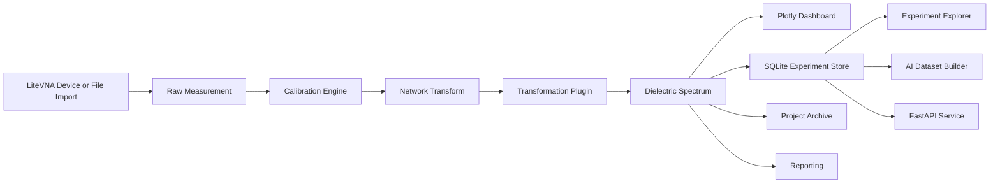

# Architecture Diagram

```mermaid
flowchart LR
    A[LiteVNA Device or File Import] --> B[Raw Measurement]
    B --> C[Calibration Engine]
    C --> D[Network Transform]
    D --> E[Transformation Plugin]
    E --> F[Dielectric Spectrum]
    F --> G[Plotly Dashboard]
    F --> H[SQLite Experiment Store]
    F --> I[Project Archive]
    F --> J[Reporting]
    H --> K[Experiment Explorer]
    H --> L[AI Dataset Builder]
    H --> M[FastAPI Service]
```

