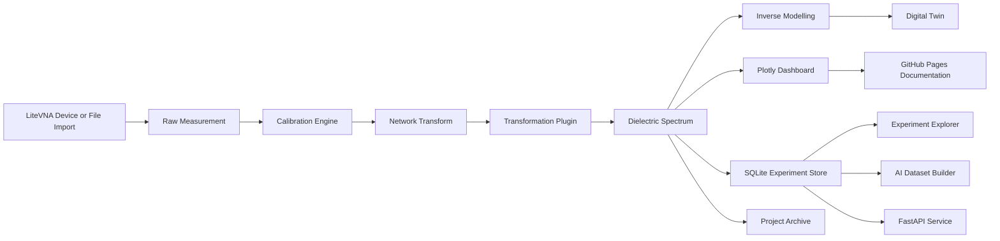

# Architecture

## Design Principles

- modular processing stages
- independently testable capture and modelling layers
- reproducible experiment storage
- research-friendly export formats
- scalable path toward future EM solver integration
