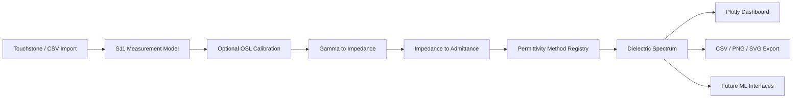

# Architecture Diagram

```mermaid
flowchart LR
    A[Touchstone / CSV Import] --> B[S11 Measurement Model]
    B --> C[Optional OSL Calibration]
    C --> D[Gamma to Impedance]
    D --> E[Impedance to Admittance]
    E --> F[Permittivity Method Registry]
    F --> G[Dielectric Spectrum]
    G --> H[Plotly Dashboard]
    G --> I[CSV / PNG / SVG Export]
    G --> J[Future ML Interfaces]
```

