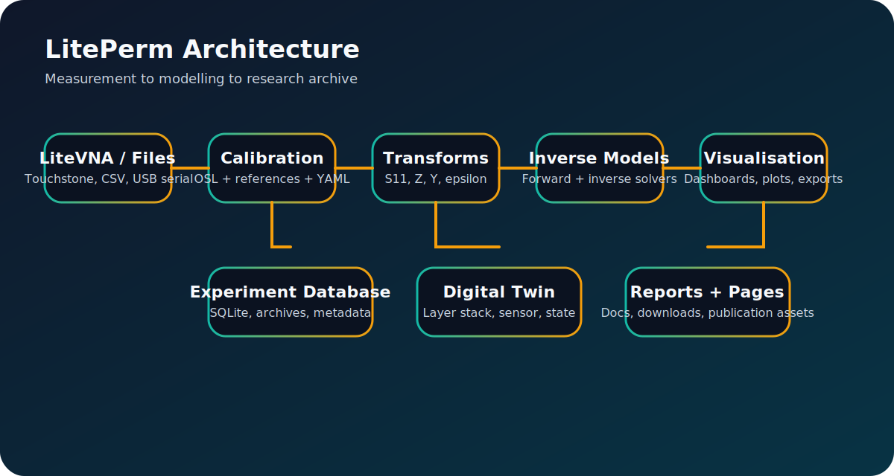
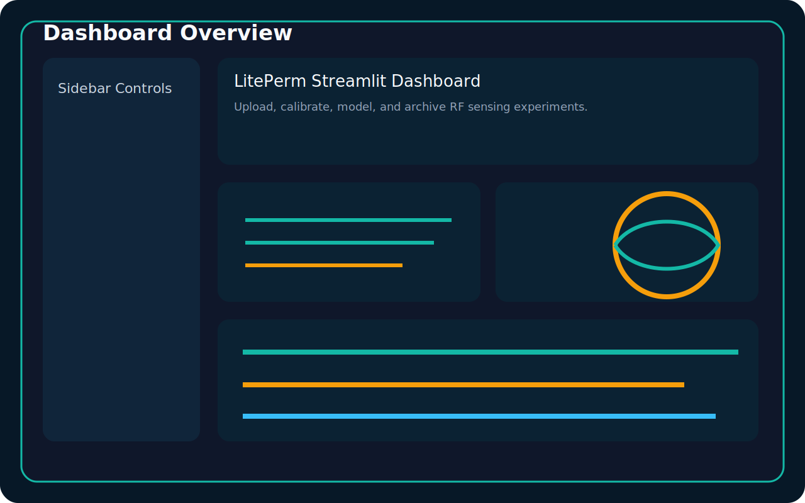
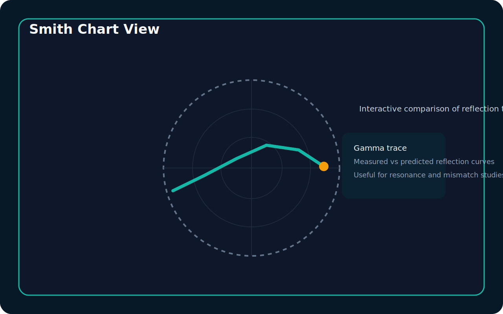
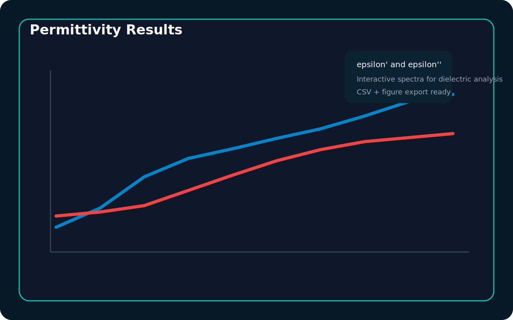
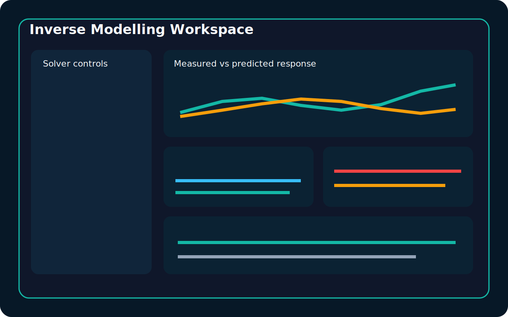
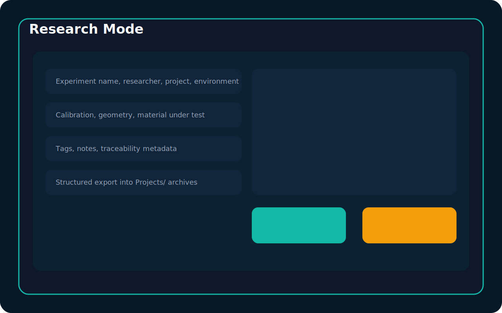
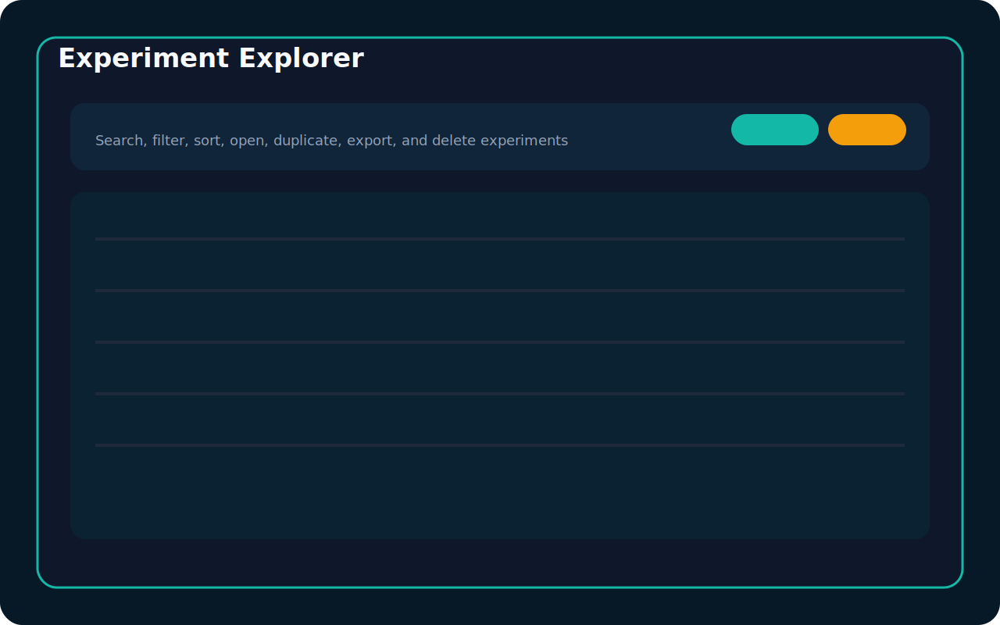
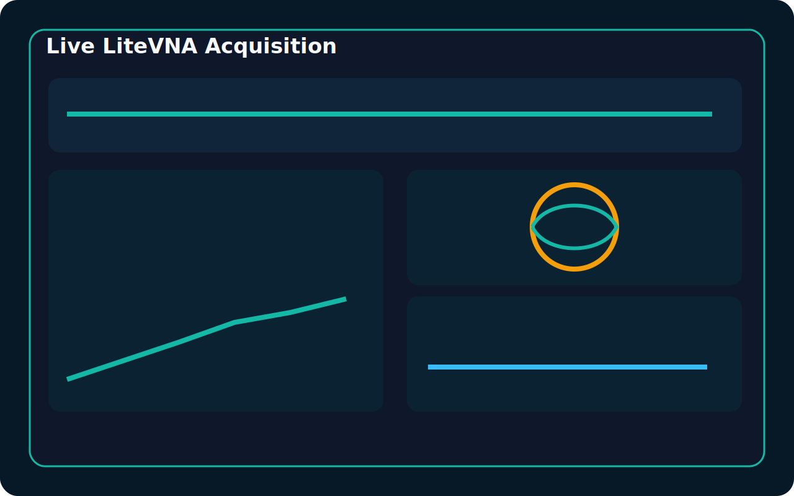

# LitePerm

<div class="lp-hero">
  <div>
    <p class="lp-eyebrow">Open-source RF sensing platform</p>
    <h1>Dielectric spectroscopy, inverse modelling, and LiteVNA research workflows in one place.</h1>
    <p>
      LitePerm turns LiteVNA S11 measurements into reproducible research outputs:
      permittivity spectra, experiment archives, inverse electromagnetic estimates,
      digital twins, and publication-ready figures.
    </p>
    <div class="lp-button-row">
      <a class="md-button md-button--primary" href="getting_started.md">Get Started</a>
      <a class="md-button" href="quick_install_5_minutes.md">Quick Install</a>
      <a class="md-button" href="first_litevna_measurement_tutorial.md">First Measurement Tutorial</a>
      <a class="md-button" href="web_demo.md">Try the Browser Demo</a>
      <a class="md-button" href="https://github.com/DionCroft/LitePerm">View on GitHub</a>
    </div>
  </div>
  <div class="lp-kpi-grid">
    <div class="lp-kpi-card"><strong>Phase 4</strong><span>GitHub Pages portal and browser demo</span></div>
    <div class="lp-kpi-card"><strong>LiteVNA-ready</strong><span>Touchstone, CSV, and USB serial workflows</span></div>
    <div class="lp-kpi-card"><strong>Inverse engine</strong><span>Forward models, solvers, uncertainty, sensitivity</span></div>
    <div class="lp-kpi-card"><strong>Research archive</strong><span>SQLite experiments, reports, metadata, YAML profiles</span></div>
  </div>
</div>

## What LitePerm Is For

<div class="grid cards" markdown>

-   :material-radio-tower: **RF sensing**

    Build workflows for resonant sensors, OECP systems, and lightweight VNA investigations.

-   :material-chart-bell-curve-cumulative: **Dielectric spectroscopy**

    Convert measured S11 into impedance, admittance, conductivity, loss tangent, and dielectric spectra.

-   :material-function-variant: **Inverse electromagnetic modelling**

    Estimate unknown material properties directly from measured RF responses using forward models and optimisers.

-   :material-hospital-box-outline: **Biomedical and materials research**

    Support implant sensors, liquids, polymers, moisture studies, and material-characterisation workflows.

</div>

## Architecture



The core research pipeline is intentionally modular:

1. Device or file import
2. Calibration and profile management
3. Network transforms and dielectric extraction
4. Forward and inverse electromagnetic modelling
5. Visualisation, experiment storage, and reporting

## Screenshots

<div class="lp-gallery">
  <div class="lp-gallery-card">
    
    <div><strong>Dashboard</strong><br />Upload, visualise, and route measurements into the analysis workflow.</div>
  </div>
  <div class="lp-gallery-card">
    
    <div><strong>Smith Chart</strong><br />Inspect reflection trajectories and compare measured and predicted responses.</div>
  </div>
  <div class="lp-gallery-card">
    
    <div><strong>Permittivity Results</strong><br />Explore epsilon', epsilon'', conductivity, and loss tangent across frequency.</div>
  </div>
  <div class="lp-gallery-card">
    
    <div><strong>Inverse Modelling</strong><br />Estimate material properties and inspect convergence, residuals, and confidence intervals.</div>
  </div>
  <div class="lp-gallery-card">
    
    <div><strong>Research Mode</strong><br />Capture metadata, save structured experiments, and generate long-term archives.</div>
  </div>
  <div class="lp-gallery-card">
    
    <div><strong>Experiment Explorer</strong><br />Search, duplicate, export, and reopen previous experiments.</div>
  </div>
  <div class="lp-gallery-card">
    
    <div><strong>Live LiteVNA Acquisition</strong><br />Configure sweep capture and push live measurements into the analysis stack.</div>
  </div>
</div>

## Quick Start

```bash
git clone https://github.com/DionCroft/LitePerm.git
cd LitePerm
python -m venv .venv
.venv\Scripts\activate
pip install -r requirements.txt
streamlit run app.py
```

If you want the fastest path to a first result, follow the [Quick Start guide](QuickStart.md).

## Project Snapshot

| Area | Current capability |
| --- | --- |
| Import | Touchstone `.s1p`, CSV, LiteVNA live acquisition |
| Analysis | S11, phase, Smith chart, impedance, admittance, permittivity |
| Modelling | Stuchly-style transforms, forward models, inverse solvers |
| Storage | SQLite experiment database plus project archive folders |
| Web | GitHub Pages portal and browser-only static demo |

## Roadmap

<div class="lp-callout">
  LitePerm now includes a GitHub Pages documentation portal and browser demo. The next major engineering milestones are continuous real-time streaming, stronger full-wave solver coupling, and AI-assisted inverse workflows.
</div>

Explore the full [Roadmap](roadmap.md), [Release Notes](release_notes.md), and [Downloads](downloads.md).
