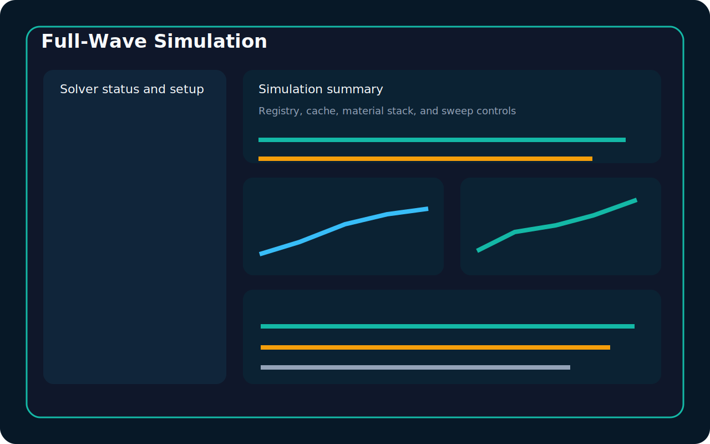

# User Manual

LitePerm is a modular RF sensing and dielectric spectroscopy platform. This manual is intended to help a colleague move from first launch to full use of the system, including experiment storage, inverse modelling, and the Phase 4 solver workflow.

The images in this manual are interface previews used to explain the layout and workflow of the application.

## Who This Manual Is For

This manual is aimed at:

- new LitePerm users
- LiteVNA users moving into dielectric analysis
- researchers using patch, OECP, or resonator workflows
- collaborators who need to understand the overall system rather than only one tab

## What LitePerm Contains

LitePerm combines several layers in one application:

1. Measurement import and live capture
2. Calibration and geometry profile management
3. RF and dielectric analysis
4. Inverse electromagnetic modelling
5. Full-wave simulation-assisted workflows
6. Experiment storage and research traceability

## Before You Start

Make sure you have:

- installed LitePerm and its dependencies
- launched the Streamlit dashboard
- opened the app in your browser

Useful setup guides:

- [Quick Install (5 Minutes)](quick_install_5_minutes.md)
- [Windows 11 Installation Guide](installation_windows_11.md)
- [LiteVNA Setup](litevna_setup.md)

## Main Interface

LitePerm uses a tab-based dashboard. The current workspace lives in session state while the app is running, so imported data and recent outputs can be reused across tabs.

### Raw Measurement

Use this tab to:

- import Touchstone or CSV files
- inspect S11 magnitude
- inspect S11 phase
- inspect the Smith chart
- verify that the measurement loaded correctly


Recommended first checks:

- the frequency range is correct
- the sample count is correct
- the magnitude plot is sensible
- the Smith trace is continuous rather than obviously corrupted

### Live Measurement

Use this tab when working directly with a LiteVNA device.

Main tasks:

- choose the device backend
- select a detected COM port or enter one manually
- connect and test the device
- set start frequency, stop frequency, points, output power, and sweep speed
- capture live S11 data
- save the latest sweep into the analysis workspace

Best practice:

- confirm the LiteVNA appears in Windows Device Manager first
- test the connection before starting a sweep
- save a stable sweep into the workspace before moving into the modelling tabs

### Calibration

Use this tab to define and store calibration context.

You can:

- import open, short, and load standard measurements
- select reference materials
- save calibration profiles to YAML
- reload saved calibration profiles from the profile library

Calibration matters because the rest of the workflow depends on the quality of the reflection data entering the transform and inverse engines.

### Sensor Geometry

Use this tab to describe the sensor you are working with.

Supported geometry families currently include:

- patch antenna
- open-ended coax probe
- microstrip resonator
- generic resonator

This tab is where you:

- edit sensor dimensions
- store geometry profiles
- reload previously saved profiles
- feed geometry into inverse modelling and full-wave workflows

### Material Properties

This is the main dielectric spectroscopy view.

Once a measurement is loaded, LitePerm can compute:

- `epsilon'`
- `epsilon''`
- loss tangent
- conductivity
- impedance
- admittance
- Nyquist plots


Typical workflow:

1. Load a measurement in `Raw Measurement`.
2. Choose a transform plugin in the sidebar.
3. Open `Material Properties`.
4. Review dielectric plots.
5. Export the spectrum to CSV if needed.

### Full-Wave Simulation

This tab was added in Phase 4.

Use it to:

- inspect solver availability
- set up a simulation sweep
- edit a material stack
- run or reuse cached simulations
- compare measured and simulated S11



What the tab currently provides:

- solver registry and status reporting
- openEMS adapter scaffold
- Meep adapter scaffold
- project-based simulation caching
- measured versus simulated comparison plots

Important note:

The solver layer is designed to fail safely. If a solver is not installed, LitePerm should show setup guidance instead of crashing.

### Inverse Modelling

This tab estimates unknown material properties from measured RF responses.

Use it to:

- choose the input response
- choose a forward model
- choose an inverse solver
- choose estimated parameters
- run inverse fitting
- inspect convergence, residuals, uncertainty, and sensitivity


Typical outputs include:

- estimated `epsilon'`
- estimated `epsilon''`
- estimated conductivity
- estimated material thickness
- convergence history
- residual error
- sensitivity ranking

Recommended approach:

1. Start with a correct geometry profile.
2. Start with a realistic layer stack.
3. Use a small number of estimated parameters first.
4. Only widen the search once the baseline behaviour makes sense.

### Advanced Modelling

This tab is useful when comparing available transformation plugins and previewing the plugin registry.

Use it to:

- inspect model descriptions
- compare plugin outputs
- preview AI dataset generation inputs

### Research Mode

Research Mode stores structured experiments for long-term use.

Metadata fields include:

- experiment name
- researcher
- project name
- description
- temperature
- humidity
- sensor type
- calibration profile
- geometry profile
- material under test
- notes
- tags


Use Research Mode after you already have:

- a loaded or captured measurement
- a computed dielectric spectrum
- optional inverse-modelling outputs

### Experiment Explorer

Use this tab to work with archived experiments.

You can:

- search
- filter
- sort
- reopen an experiment into the active workspace
- duplicate an experiment
- export an experiment archive
- delete an experiment


### Material Database

This tab exposes the stored materials database for reference and future extension.

Built-in materials include:

- air
- water
- methanol
- ethanol
- acetone
- saline
- FR4
- PTFE
- Rogers 5880

## Sidebar Controls

The sidebar contains pipeline-wide settings.

Main items:

- transformation plugin
- whether to apply calibration
- architecture links
- developer links

Remember that the chosen transformation plugin affects the `Material Properties` calculations.

## Recommended End-to-End Workflow

### Workflow A: File Import to Permittivity Plot

1. Open `Raw Measurement`.
2. Import `sample_touchstone.s1p` or your own `.s1p` / `.csv`.
3. Confirm the magnitude and Smith plots look correct.
4. Open `Material Properties`.
5. Review the dielectric outputs.
6. Export the spectrum CSV if needed.

### Workflow B: LiteVNA to Stored Experiment

1. Connect the LiteVNA in `Live Measurement`.
2. Configure the sweep.
3. Capture and save the sweep into the workspace.
4. Open `Material Properties` and compute the dielectric spectrum.
5. Open `Research Mode`.
6. Fill in metadata and save the experiment.

### Workflow C: Inverse Estimation

1. Load a measured response.
2. Confirm the geometry in `Sensor Geometry`.
3. Open `Inverse Modelling`.
4. Select the forward model that matches the sensor.
5. Choose a solver such as least-squares or differential evolution.
6. Choose the parameters you want to estimate.
7. Run the inverse estimation.
8. Review residuals, convergence, uncertainty, and sensitivity.

### Workflow D: Simulation-Assisted Comparison

1. Load or capture a measured response.
2. Open `Full-Wave Simulation`.
3. Review solver status.
4. Edit the material stack.
5. Define the sweep and mesh quality.
6. Run the simulation or reuse cache.
7. Compare measured versus simulated S11.

## Understanding the Main Data Objects

LitePerm is organised around a few core objects:

- `MeasurementData`
  Imported or captured S11 data.
- `MaterialSpectrum`
  Computed dielectric and network properties.
- `CalibrationProfile`
  Saved OSL and reference-material context.
- `SensorGeometryProfile`
  Saved sensor dimensions and notes.
- `SimulationJob`
  A full-wave solver request.
- `SimulationResult`
  A full-wave solver response.
- `InverseResult`
  Output from the inverse-modelling engine.
- `DigitalTwin`
  A measurement-linked snapshot of sensor, calibration, and inferred state.

## Files and Storage

LitePerm stores runtime data in several places.

### Profiles

Saved profiles live under:

```text
profiles/
```

### Experiments

Experiments are stored in:

```text
liteperm/database/experiments.db
```

and also archived into project folders under:

```text
Projects/<ProjectName>/<ExperimentID>/
```

### Simulations

Phase 4 simulations are cached under:

```text
Projects/<ProjectName>/simulations/<CacheKey>/
```

## Full-Wave Solver Notes

LitePerm currently includes:

- openEMS adapter scaffold
- Meep adapter scaffold
- placeholder space for future HFSS, CST, and COMSOL integration

Read these pages before relying on the solver workflow:

- [Full-Wave Solver Guide](full_wave_solver_guide.md)
- [Simulation Workflow](simulation_workflow.md)
- [openEMS Setup Guide](openems_setup_guide.md)
- [Meep Setup Guide](meep_setup_guide.md)

## API Usage

LitePerm includes a FastAPI app for future integrations and automation work.

Start it with:

```powershell
uvicorn liteperm.api.app:create_api_app --factory
```

Then open:

```text
http://localhost:8000/docs
```

## Troubleshooting

### The import failed

Check:

- the file type is `.s1p` or `.csv`
- the CSV contains frequency plus valid S11 columns
- the data is not empty

### The LiteVNA does not connect

Check:

- the correct COM port
- the USB cable
- the device appears in Device Manager
- the device backend is set correctly

### The inverse solver gives poor results

Check:

- the geometry profile
- the layer stack
- the chosen parameter bounds
- whether too many parameters are being estimated at once

### The full-wave solver is missing

This is expected if openEMS or Meep is not installed. LitePerm should show a helpful setup message rather than failing.

## Recommended Learning Path

If you are new to LitePerm, this order works well:

1. [Quick Install (5 Minutes)](quick_install_5_minutes.md)
2. [First LiteVNA Measurement Tutorial](first_litevna_measurement_tutorial.md)
3. `Raw Measurement`
4. `Material Properties`
5. `Research Mode`
6. [Inverse Modelling Guide](inverse_modelling_guide.md)
7. [Full-Wave Solver Guide](full_wave_solver_guide.md)

## Related Documentation

- [Getting Started](getting_started.md)
- [Calibration Guide](calibration_guide.md)
- [Patch Antenna Guide](patch_antenna_guide.md)
- [OECP Guide](oecp_guide.md)
- [Research Mode Guide](research_mode_guide.md)
- [Roadmap](roadmap.md)
